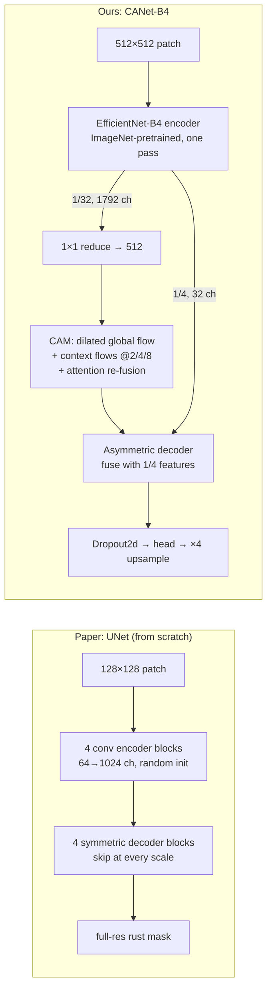

# Improvement summary: CANet-B4 over the NWRD baseline

*Last updated 2026-09-22. Companion documents: [`paper_summary.md`](paper_summary.md) (the
baseline paper) and [`compare.md`](compare.md) (full comparison, findings, threats to validity).*

This document explains what our implementation changes relative to the NWRD paper's UNet + APF
pipeline (Anwar et al., *Sensors* 2023), why each change should improve results, and how much of
that is already proven.

Every claim carries one of three labels:

| Label | Meaning |
|---|---|
| ✅ **Measured** | Verified in this repository, with the command or source given |
| 🔬 **Reasoned** | Follows from how the component works; the re-run will confirm or refute it |
| ⏳ **Pending** | Needs the Kaggle run (`notebooks/nwrd_experiments.ipynb`); fill from `runs/comparison.md` |

---

## 1. The claim, stated precisely

**What we can say today.** CANet-B4 is a pretrained, context-aware segmentation network. At
512×512 it needs **10.4× fewer FLOPs** than the paper's UNet and runs **4.0× faster on CPU** ✅.
Its provisional F1 on our patched validation data is **0.896**, against the paper's published
**0.557** 🔬.

**Why the 0.896 vs 0.557 gap isn't yet a result.** The two numbers come from different test sets
(512px patches of `nwrd-patched` vs 128px patches of 10 held-out field images), and ours used a
threshold tuned on the split it reported. Some of the gap is certainly protocol. The re-run trains
the paper's UNet beside CANet under one protocol and settles how much is architecture ⏳.

**The claim we are testing:**

> Trained and evaluated under an identical protocol, CANet-B4 segments wheat stripe rust more
> accurately than the NWRD paper's UNet, at a fraction of its inference cost.

The decision rule is fixed in advance ([`compare.md`](compare.md) §5.2): higher mean test IoU,
a bootstrap 95% CI for ΔIoU that excludes 0, and a win on at least 2 of 3 seeds.

---

## 2. What is architecturally different

### 2.1 Side by side

### 2.2 Component by component

| Component | Paper UNet | CANet-B4 (ours) | Why it should help on NWRD | Status |
|---|---|---|---|---|
| **Encoder** | 4 plain conv blocks, trained from scratch on 80 images | **EfficientNet-B4**, ImageNet-pretrained: MBConv blocks with squeeze-and-excitation, compound-scaled depth/width/resolution | NWRD has 100 images (paper Table 1). A scratch network has to learn edges, textures and colour from those alone; a pretrained encoder starts with them. That typically matters most when data is scarce. The authors name "fine-grained feature extraction" as future work (paper §6) | 🔬 (isolated by the `deeplabv3plus_b4` ablation vs `unet`) |
| **Context** | None beyond network depth; one 128px patch of a 0.5× image (≈256px of the original) is all the model sees | **CAM** (chained context aggregation): serial dilated convs (d = 2, 4, 8) widen the receptive field step by step; three parallel pooled context flows (scales 2/4/8) add region summaries; outputs are concatenated and re-weighted by channel attention | Rust's colour overlaps with senescent leaves, soil and glare. Telling them apart needs surrounding structure: lesions sit *on leaves*, in *stripes*. CAM supplies that context; 512px patches give it room | 🔬 (isolated by CANet vs `deeplabv3plus_b4`) |
| **Attention** | None | Channel attention after pre-fusion (`AttentionFusion`) | Can suppress context channels that fire on background, which targets the paper's weakest metric: precision 0.506 < recall 0.624 means it over-predicts rust | 🔬 Watch precision in the re-run |
| **Decoder** | Symmetric, four skip connections | **Asymmetric**: one skip from 1/4 resolution (32→48 ch) fused with upsampled context, two 3×3 convs | Spends compute where information is (deep context), not on expensive full-resolution decoding. This is where most of the FLOP saving over UNet comes from | ✅ for cost (§4) |
| **Regularisation** | Not described beyond augmentation | Dropout2d (p = 0.5) before the head; EfficientNet drop-connect; AdamW weight decay | Reduces overfitting on a small dataset | 🔬 |
| **Output** | Full resolution | Predicted at 1/4, bilinear ×4 | Cheaper; **known weakness**: the thinnest lesion edges can blur. UNet's full-resolution skips are better here, so this is a deliberate trade | 🔬 Check small-lesion recall qualitatively |

**Attribution.** The CAM (global flow, context flows, attention-guided re-fusion) and the
asymmetric decoder follow the chained context aggregation design of CANet (Tang et al.,
*Attention-guided Chained Context Aggregation for Semantic Segmentation*, arXiv:2002.12041;
verify the reference before submission). **Our contribution is the adaptation, not the module:**
pairing it with an EfficientNet-B4 encoder for single-class rust segmentation, and the training
and evaluation around it (§3, §5).

---

## 3. Techniques: replaced, improved, enhanced

These are the method changes that can affect accuracy. Evaluation changes, which make the numbers
trustworthy but don't raise them, are in §5.

| Area | Paper | Ours | Type | Reasoning | Status |
|---|---|---|---|---|---|
| **Backbone initialisation** | Random | ImageNet weights; encoder frozen for the first 3 epochs, then fine-tuned | **Replaced** | Freezing first lets the new CAM/decoder settle before gradients reach the pretrained encoder, so the pretrained features aren't disrupted early | 🔬 |
| **Input scale** | 0.5× Lanczos downsampling, 128px patches | 512px patches, no further downsampling in our pipeline | **Replaced** | 16× more pixels per patch (512² vs 128²), which gives CAM usable context; the paper itself notes downsampling costs F1 (§3.4.1) | 🔬 |
| **Class-imbalance handling (sampling)** | APF: rust patches + false-positive patches fed back every 5 epochs; needs periodic full forward passes | All rust-positive patches + a fixed, seeded 20% of background-only patches | **Replaced** (simplified) | Keeps background in training, the paper's own argument (§5), without the feedback machinery. Deterministic, so identical for every model | 🔬 APF is *not* reproduced; see §7 |
| **Class-imbalance handling (loss)** | Focal loss | 0.7·Dice + 0.3·BCE with `pos_weight` = background/rust pixel ratio (2.96–3.65 in earlier runs) | **Replaced** | Dice optimises region overlap directly (the reported metric) and ignores the background majority; weighted BCE keeps per-pixel gradients stable | 🔬 |
| **Optimiser** | RMSprop, lr 1e-6, exponential decay | AdamW, lr 5e-5, weight decay 1e-4 | **Replaced** | AdamW's decoupled weight decay is the standard for fine-tuning pretrained CNNs | 🔬 |
| **Schedule** | 500 epochs, batch 64 | 30 epochs, batch 8, cosine annealing with warm restarts (T₀ 5, ×2) | **Improved** | Pretraining converges in far fewer epochs; warm restarts help escape poor minima | ✅ 16.7× fewer epochs (config); ⏳ wall-clock |
| **Numerics** | Not stated | fp16 mixed precision, gradient clipping at 1.0 | **Enhanced** | Faster and lighter on memory (fits a free T4); clipping stabilises fine-tuning | ⏳ confirmed when the Kaggle T4 run completes |
| **Augmentation** | Horizontal and vertical flips | Flips + 90° rotations + brightness/contrast + elastic deformation | **Enhanced** | Field images vary in orientation and light; elastic deformation mimics irregular lesion shapes | 🔬 |
| **Threshold** | Not stated (presumably 0.5) | Chosen on **validation** over 0.05–0.95, frozen for test; 0.5 also reported | **Enhanced** | Under class imbalance the best threshold is rarely 0.5. Choosing on val (never test) captures that without leaking | 🔬 |
| **Model selection** | Not stated | Best pooled validation IoU per epoch | **Enhanced** | Keeps the best epoch, not the last; uses val only | ✅ |

---

## 4. Efficiency: proven now

Measured with `nwrd.benchmark` on 2026-09-22 at a 1×3×512×512 input, fp32 on CPU (Intel Core,
4 threads, PyTorch 2.7.1), median of 3 runs.

| Model | Params (M) | GFLOPs | CPU latency (ms) | CANet-B4 advantage |
|---|---|---|---|---|
| **CANet-B4 (ours)** | 29.39 | **36.9** | **955** | – |
| UNet (paper architecture) | 31.04 | 385.3 | 3,791 | **10.4× fewer FLOPs, 4.0× faster** |
| DeepLabV3+ ResNet-50 | 26.68 | 73.1 | 1,139 | 2.0× fewer FLOPs, 1.2× faster |
| DeepLabV3+ EfficientNet-B4 | 18.62 | 35.7 | 1,194 | same FLOPs, 1.25× faster |

✅ **Where the saving comes from (being precise matters here).** Almost all of it comes from
**where computation happens**. UNet runs 64–128-channel convolutions at full and half
resolution, which dominates its 385 GFLOPs. CANet-B4 does its heavy lifting at 1/32 resolution and
decodes lightly at 1/4. Against the same-encoder DeepLabV3+, CANet costs the same FLOPs and has
10.8M more parameters, so **CAM is not what makes CANet cheap**. CAM earns its place only if it
improves accuracy. That is exactly what the CANet vs DeepLabV3+-B4 ablation tests ⏳.

Per image area the ratio holds at any patch size, because both networks are fully convolutional.
The paper recovers some cost by downsampling images 0.5× first; we don't.

GPU latency, throughput, memory and training time per epoch for all models, on one Kaggle GPU:
⏳ `runs/benchmark.json`.

---

## 5. Evaluation rigour: why our numbers can be trusted

These changes don't make the model better. Some will make its numbers *lower* than before. They
are what makes a claimed improvement credible, and that is a large part of the distinction.

| Aspect | Paper / earlier in-house runs | Ours | Why it matters |
|---|---|---|---|
| Baseline | Paper: published numbers only | Paper's UNet **re-trained under our protocol**, plus `unet_tuned` (lr 1e-3) so it isn't handicapped by settings tuned for pretrained models; the stronger by val IoU is used | Like-for-like, and immune to "the baseline was under-trained" |
| Test set | Earlier in-house: validation set, threshold tuned on it | Held-out **test** split, touched once | Removes the optimistic bias of tuning on the reported split |
| Repeats | Single run | **3 seeds**, mean ± std | Separates real gaps from seed noise |
| Significance | Paper: none. Internship report: z-tests on F1 treated as a proportion (invalid, `compare.md` F9) | Paired **image-level bootstrap** (5,000 resamples) + seed-level paired t-test | Respects the correlation between pixels of one image |
| Metric definition | Paper: likely per-image averages (`paper_summary.md` §6 C6) | Pooled over every test pixel, plus a Table-4-style variant (rust patches only) | Standard, stable, and comparable with both paper tables |
| Ablations | None for architecture | `deeplabv3plus_b4` (same encoder) and `unet_tuned` (tuned lr) | Separates encoder, head and hyperparameter effects |
| Leakage check | Not considered | Notebook prints the dataset's split notes and filenames | Patched datasets can leak between splits |
| Reproducibility | Notebook cells; the Sprint 1 model definition is lost | One package (`nwrd/`), generated notebook, fixed seeds, resumable runs, 9 automated tests | Anyone can reproduce every number |

---

## 6. Fixes to our own earlier implementation

Engineering corrections that changed results or cost:

| Fix | Effect | Status |
|---|---|---|
| **Encoder ran twice per forward pass** (`extract_features` + `extract_endpoints`) | One pass: bit-identical outputs, 30% fewer FLOPs (52.5 → 36.9), 1.8× faster on CPU | ✅ tested (`test_canet_single_pass_matches_two_pass`) |
| **Per-batch IoU averaging** scored a correctly predicted background-only batch as 0 | Pooled metrics; the checkpoint is now selected on the true IoU (training curves had read about 0.58 while true IoU was about 0.81) | ✅ unit-tested against direct counting |
| **Threshold grid capped at 0.79**, with the optimum on the edge | Grid 0.05–0.95, edge optimum flagged | ✅ |
| **Inconsistent configs between runs** (10% vs 20% background, different grids) | One config for every model | ✅ |
| **Served checkpoint didn't match the published metrics** | The exported checkpoint ships with its own metrics, chosen by val | ✅ |
| **Hard-coded threshold 0.45 in the app** | The app uses the val-selected threshold | ✅ |

---

## 7. What is *not* claimed, and why

Being explicit about the limits is part of what makes the rest believable.

1. **We don't claim to beat APF as a technique.** Our UNet re-run uses our patch sampling, not
   APF. The claim is about the **architecture** under a common protocol. Beating "UNet + APF" as a
   full method would need APF implemented.
2. **We don't claim CAM is efficient.** The measured saving comes from the encoder and the
   asymmetric decoder (§4).
3. **We don't claim to have reproduced the paper's own test protocol.** Full-image evaluation on
   the paper's split needs the original images and patch coordinates, which `nwrd-patched` lacks.
4. **Absolute numbers may be optimistic if `nwrd-patched` leaks between splits.** That would
   inflate all models alike, keeping the ranking meaningful but not the absolute gap to the paper.
5. **Pretraining is part of the advantage.** It's a legitimate design choice, and it is disclosed.
   The `deeplabv3plus_b4` ablation shows how much comes from the encoder alone.

---

## 8. Why this implementation is the distinction

1. **A better-matched architecture for the problem the authors themselves identified.** The paper
   says UNet struggles because "the rust spots … are very small" and calls for "fine-grained
   feature extraction" (§5–6). CANet-B4 answers with pretrained fine-grained features and explicit
   multi-scale context 🔬.
2. **Order-of-magnitude cheaper inference.** 10.4× fewer FLOPs than the baseline network at the
   same input size, 4.0× faster on CPU ✅. That makes field or drone deployment, which the paper
   motivates (§1), realistic on modest hardware.
3. **Far cheaper training.** 30 epochs on one free T4 instead of 500 epochs on two V100s. The
   paper's full-dataset run took 4,791 min ✅ (config); our wall-clock time is ⏳.
4. **A comparison that holds up.** The baseline re-trained under the same protocol and given a
   fair learning rate, a held-out test set, 3 seeds, image-level significance testing, ablations
   that isolate each component, and a decision rule fixed before the results.
5. **A reproducible system, not a notebook.** One shared model definition for training, API and
   dashboard, a resumable pipeline, automated tests, and a working web app.

---

## 9. Results (fill in after the run)

| | IoU | F1 / Dice | Precision | Recall | GFLOPs | GPU latency (ms) |
|---|---|---|---|---|---|---|
| Paper, published (Table 3 / Table 4) | – / 0.438 | 0.557 / 0.564 | 0.506 / 0.593 | 0.624 / 0.552 | – | – |
| UNet, re-trained (stronger of `unet` / `unet_tuned`) | ⏳ | ⏳ | ⏳ | ⏳ | 385.3 | ⏳ |
| DeepLabV3+ R50 | ⏳ | ⏳ | ⏳ | ⏳ | 73.1 | ⏳ |
| **CANet-B4 (ours)** | ⏳ | ⏳ | ⏳ | ⏳ | **36.9** | ⏳ |
| **Δ CANet vs UNet [95% CI]** | ⏳ | ⏳ | | | **−90%** | ⏳ |

Once filled: if the decision rule in §1 is met, the accuracy claim is proven and every 🔬 in §2–3
that the ablations support can be upgraded to ✅. If it isn't, the defensible contribution is the
efficiency result (§4) at comparable accuracy. That is still a real result, and it should be
reported as such rather than overstated.
