# Paper summary: *The NWRD Dataset* (Anwar et al., Sensors 2023)

> Anwar, H.; Khan, S.U.; Ghaffar, M.M.; Fayyaz, M.; Khan, M.J.; Weis, C.; Wehn, N.; Shafait, F.
> **The NWRD Dataset: An Open-Source Annotated Segmentation Dataset of Diseased Wheat Crop.**
> *Sensors* 2023, 23(15), 6942. doi:[10.3390/s23156942](https://doi.org/10.3390/s23156942).
> Code and data: [github.com/dll-ncai/NUST-Wheat-Rust-Disease-NWRD](https://github.com/dll-ncai/NUST-Wheat-Rust-Disease-NWRD)

This is the **baseline paper** for our project: its UNet + APF result is the published state of
the art on NWRD that our CANet-B4 is compared against. See [`compare.md`](compare.md).

**How to read this document.** Every figure and table image below was extracted directly from the
published PDF (`sensors-23-06942.pdf`) by
[`scripts/extract_paper_figures.py`](../scripts/extract_paper_figures.py). Figures are the PDF's
embedded images at native resolution; tables are crops of the rendered page. Nothing is redrawn,
with one exception, clearly marked in §3.5. Quotations are verbatim and give page and section
numbers. Claims are checked in §6; the arithmetic there was re-computed, not copied.

---

## TL;DR

- **Contribution 1: a dataset.** NWRD is 100 high-resolution field images (4608×3456, a few
  6016×4000) of wheat with **stripe rust**, with pixel-level binary masks. It is the first
  multi-leaf, wide-angle *segmentation* dataset for wheat rust.
- **Contribution 2: a training pipeline.** Downsample the images, cut 128×128 patches, and train
  a **plain UNet** on patches chosen by **adaptive patching with feedback (APF)**: rust patches,
  plus the patches where the model recently produced false positives.
- **Headline result:** rust-class **precision 0.506, recall 0.624, F1 0.557** on the full dataset
  (Table 3). Versus Octave-UNet under the same pipeline: **F1 0.564 / IoU 0.438 vs 0.529 / 0.316**
  (Table 4).
- **Main trade-off:** APF gives up a little F1 in exchange for much shorter training (for example
  F1 0.650 in 1.8 days vs 0.684 in 11 days on 22 images).
- **Caveats found on checking (§6):** single runs with no variance; two of the full-dataset rows
  and all of Table 4 aren't arithmetically consistent as pooled metrics; the "~10× fewer patches"
  claim is 4–6× by the paper's own Table 2.

---

## 1. Problem and motivation

> "Wheat stripe rust disease (WRD) is extremely detrimental to wheat crop health, and it severely
> affects the crop yield, increasing the risk of food insecurity." (p. 1, Abstract)

> "According to estimates, 88% of the world's wheat production is susceptible to WRD infection,
> and 5.47 million tons of wheat are lost to this disease each year [2]." (p. 2, §1)

**The gap it addresses.** Existing wheat-disease datasets are mostly *classification* sets of
close-up single leaves. Estimating *how much* of a field is infected needs pixel-level
*segmentation* on realistic field images:

> "Classification of WRD into different types and categories is a task that has been solved in the
> literature; however, semantic segmentation of wheat crops to identify the specific areas of
> plants and leaves affected by the disease remains a challenge." (p. 1, Abstract)

---

## 2. The NWRD dataset

### 2.1 Collection

- **Where and when:** the National Agriculture Research Centre (NARC), Islamabad, over one season
  (sown November 2021, harvested May 2022), photographed in the morning and afternoon as rust
  spread from February to April (p. 5, §3.1–3.2).
- **Resolution:** "a few images of 6016 × 4000 resolution, while the rest have a resolution of
  4608 × 3456" (p. 5, §3.2).
- **Size:** 100 annotated images (Table 1).

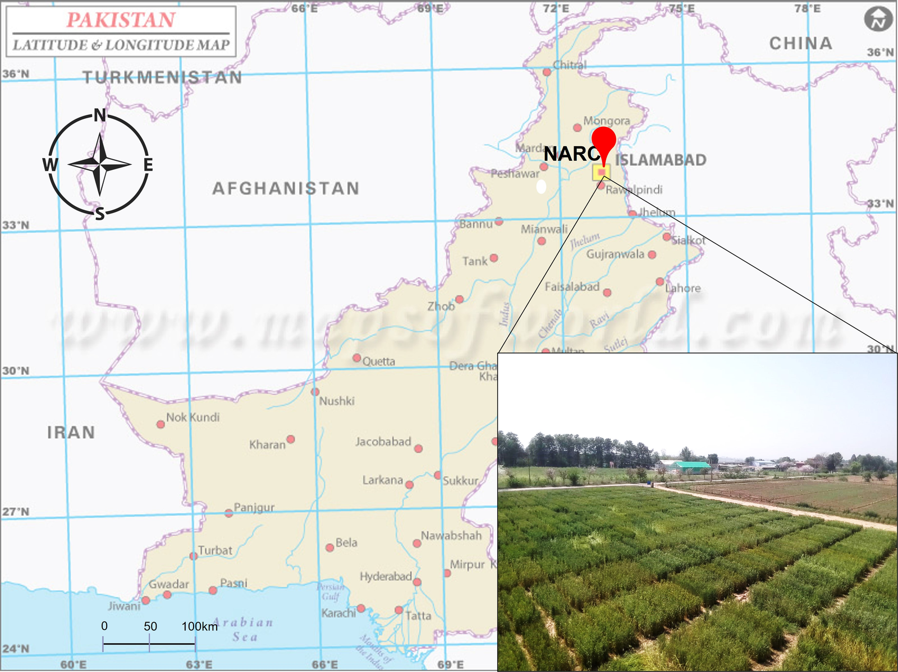

*Figure 1 (p. 5). Aerial view of the data-collection wheat fields at NARC, Islamabad.*

### 2.2 Properties, and why the dataset is hard

The paper lists the properties that make NWRD harder than earlier sets (p. 6, §3.3):

- multi-leaf, **slightly wide-angle** views with busy backgrounds and occlusions;
- **arbitrarily shaped** disease regions ("geometric shapes in annotation tools cannot capture"
  them), so masks were drawn by hand at a fine-grained level;
- natural light that varies within and across images;
- **class imbalance**: "the majority of the leaves are of the healthy wheat crop class, while a
  minority of the diseased class creates an imbalance".

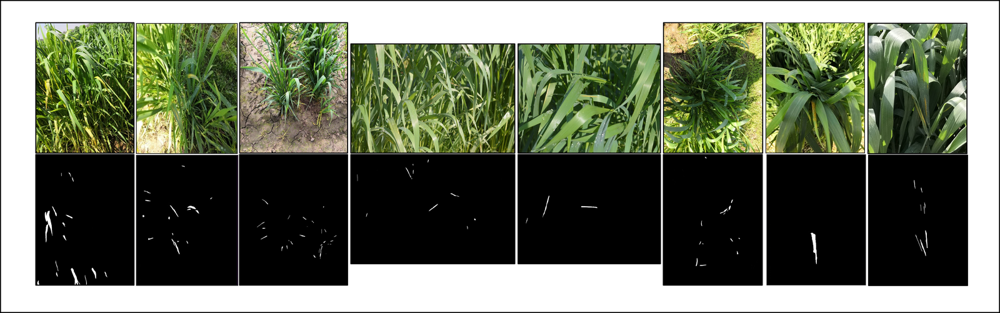

*Figure 2 (p. 6). Sample NWRD images with their binary masks (white = rust).*

### 2.3 Position among existing datasets

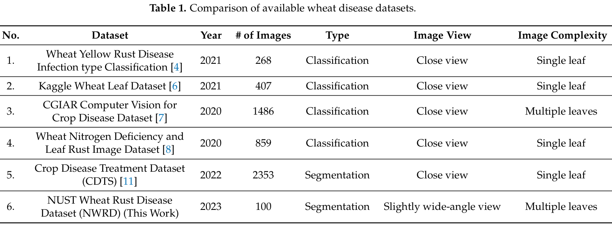

*Table 1 (p. 3).* The only other segmentation set, CDTS (2,353 images), is close-view and single
leaf. NWRD is the only multi-leaf, wide-angle segmentation dataset. It is also by far the
smallest, at 100 images, which matters for any model trained on it (see our note in §7).

---

## 3. Method: the disease detection pipeline

### 3.1 Overview (Figure 3: the paper's architecture diagram)

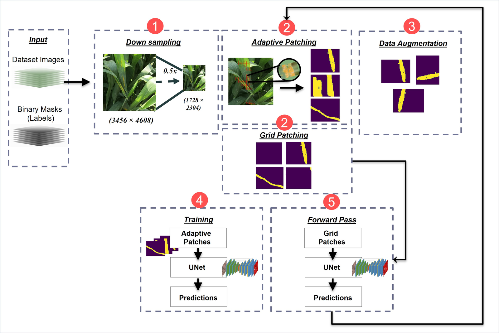

*Figure 3 (p. 7), verbatim caption:* "Step (1) involves the downsampling of input images to reduce
their size. Step (2) is the process of generating patches from input images. It includes both an
adaptive patching module and a grid patching module. Step (3) is the data augmentation step at the
patch level. Step (4) includes the training process, with adaptive patches as input to the UNet
segmentation model, generating predictions. Step (5) is the forward pass that uses grid patches for
UNet segmentation and generates prediction masks. These predictions are then sent to the AP module
as feedback."

**Reading the diagram.** The pipeline has two loops. The *inner* loop (step 4) trains UNet on
adaptive patches. The *outer* loop (step 5 → step 2, the long arrow) runs UNet over **all** grid
patches of the training images every few epochs and feeds its predictions back into patch
selection. That feedback is what separates APF from plain adaptive patching.

### 3.2 Step 1: downsampling

Figure 3 shows a **0.5× reduction** (3456×4608 → 1728×2304). The paper uses Lanczos filtering to
limit aliasing (p. 7, §3.4.1):

$$
L(x) = \begin{cases} \operatorname{sinc}(\pi x)\,\operatorname{sinc}\!\left(\tfrac{\pi x}{a}\right), & -a \le x \le a \\ 0, & \text{otherwise} \end{cases}
$$

> "The process of downsampling results in a slight decrease in the F1 score, but this is a
> tradeoff with the benefit of faster training in the case of a large dataset." (p. 7, §3.4.1)

(The paper gives no number for this "slight decrease"; see §6, claim C5.)

### 3.3 Step 2: patching (GP, AP and APF)

All patches are **128×128** (p. 8, §3.4.2). The paper compares three strategies:

| Strategy | What it selects | Stated rationale |
|---|---|---|
| **Grid patching (GP)** | Every patch on a regular grid (stride 32 or 128, so overlapping at 32) | Standard, but "generates a lot of unnecessary patches that contain non-rust parts" (p. 8) |
| **Adaptive patching (AP)** | Only patches with **≥ 1% rust pixels** | Fewer patches, faster training, but "the model becomes biased towards rust and generates false positives" (p. 8) |
| **AP with feedback (APF)** | AP patches **plus** patches around the model's false positives, refreshed every 5 epochs | Keeps AP's speed while teaching the model where it errs (p. 8–10) |

How the feedback works, in the paper's words:

> "model predictions are merged with the target binary masks of input images in order to include
> noisy patches for training. The new mask then contains both areas that are annotated as rust in
> the original masks and areas that the model segmented as rust." (p. 8, §3.4.2)

> "we observed that 5 epochs between the adaptive patching process yield better results in
> providing a good balance between time complexity and accuracy" (p. 10, §3.4.5)

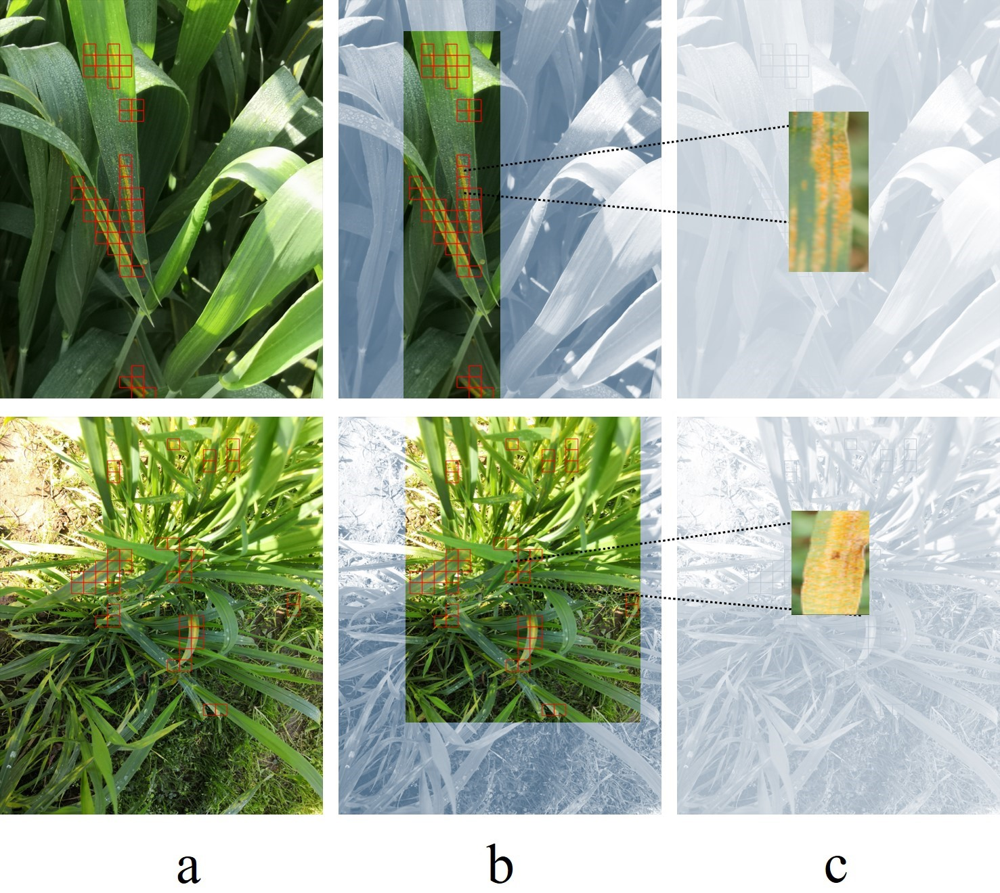

*Figure 4 (p. 9). (a) Sample image, red boxes marking rust; (b) a section with rust-affected
leaves; (c) the final patches fed to the model.*

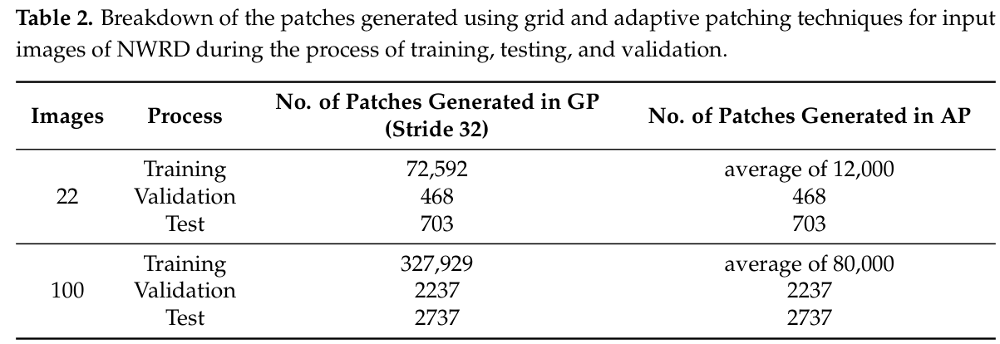

*Table 2 (p. 10).* On the full dataset, grid patching at stride 32 produces 327,929 training
patches and adaptive patching about 80,000. Validation (2,237) and test (2,737) patches are the
same under both methods: **evaluation always uses grid patches.**

### 3.4 Step 3: augmentation

Patch-level **horizontal and vertical flips** only (p. 9, §3.4.3).

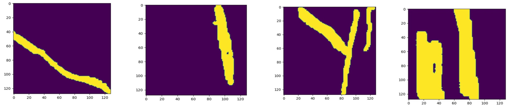

*Figure 5 (p. 9). Example patches; yellow is rust, purple is non-rust.*

### 3.5 Step 4: the segmentation model (UNet)

The paper describes the network in one sentence and gives **no layer-level diagram**:

> "A UNet model with 4 encoders and 4 decoder blocks was trained with the preprocessed dataset. The
> model input size was set to 128 × 128 pixels." (p. 10, §3.4.4)

For reference only, here is the standard 4-down / 4-up UNet that sentence describes, as
implemented for our re-run in `nwrd/models.py` (`UNet`, 31.0M parameters). **This diagram is our
reconstruction, not taken from the paper.** Channel widths are the usual UNet defaults; the paper
doesn't state them.

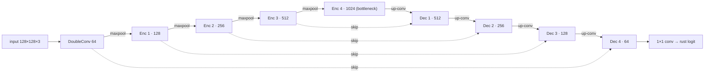

### 3.6 Step 5: the feedback forward pass

The second forward pass runs over grid patches of the training images, merges predictions with
the ground truth, and hands the merged mask back to the AP module for the next 5 epochs (p. 10,
§3.4.5). It adds inference cost periodically, but it is what lets APF include background patches
the model gets wrong.

---

## 4. Experimental setup

| Setting | Value | Source |
|---|---|---|
| Split | Random **80 / 10 / 10 by image** | p. 11, §4.2 |
| Subsets | 22 images (hyperparameter search) and all 100 | p. 11–12 |
| Optimiser | RMSprop, initial lr **1e-6**, ExponentialLR decay | p. 11, §4.2 |
| Epochs / batch | **500** epochs, batch **64** | p. 11, §4.2 |
| Stride | 32 and 128 | p. 11, §4.2 |
| Loss | Focal loss ("yielded the best results" vs Dice) | p. 11, §4.2 |
| Hardware | 2× NVIDIA Tesla V100, 32 GB each | p. 11, §4.2 |
| Metrics | Rust-class precision, recall, F1 (+ IoU in Table 4) | p. 10–11, §4.1 |

**Why F1:** "F1 score is a helpful evaluation metric for imbalanced data because it provides a
balanced measure of precision and recall" (p. 10, §4.1).

---

## 5. Results

### 5.1 Patching strategies (Table 3)

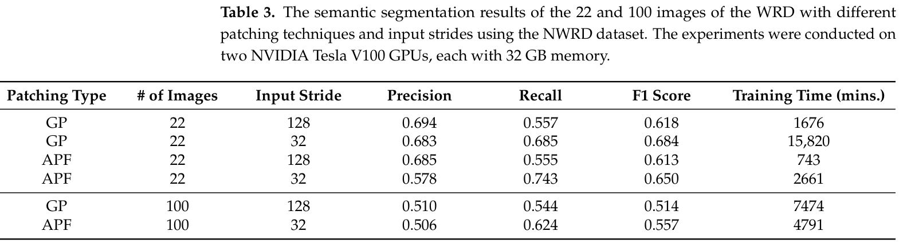

*Table 3 (p. 12).* What it shows:

- **Best overall:** GP, stride 32, 22 images: F1 **0.684**, but it "took approximately 11 days to
  train" (15,820 min = 10.99 days ✓).
- **APF's trade-off:** APF, stride 32, 22 images reaches F1 **0.650** in 2,661 min (1.85 days ✓).
  That is **5.9× faster for −0.034 F1**.
- **Headline, full dataset:** APF, stride 32: **P 0.506, R 0.624, F1 0.557**, 4,791 min (3.3 days).
  GP at stride 32 "did not complete due to the high memory utilization of the GPU" (p. 12), so the
  only full-dataset GP number is at stride 128 (F1 0.514, 7,474 min). Against that, APF is both
  better (+0.043 F1) and 1.56× faster.
- **More data, lower scores:** the two configurations run at both sizes lose about 0.1 F1 going
  from 22 to 100 images (GP-128: 0.618 → 0.514; APF-32: 0.650 → 0.557). The larger, more varied
  set is harder, not easier, for this model.

### 5.2 Against the state of the art (Table 4)

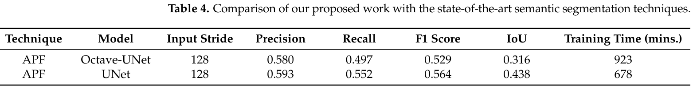

*Table 4 (p. 13).* Both models use APF with stride 128, following Li et al.'s protocol, in which
"images containing only background were removed from the train and test datasets" (p. 12, §5).
UNet beats Octave-UNet: F1 **0.564 vs 0.529**, IoU **0.438 vs 0.316**, and trains faster (678 vs
923 min).

The authors also argue *against* that background-removal protocol:

> "We argue that removing the background images from the dataset hinders the ability of the model
> to learn the actual trend of the onset of the disease. Consequently, the model will generate false
> positives when tested on real-world WRD field data." (p. 13, §5)

### 5.3 Qualitative results

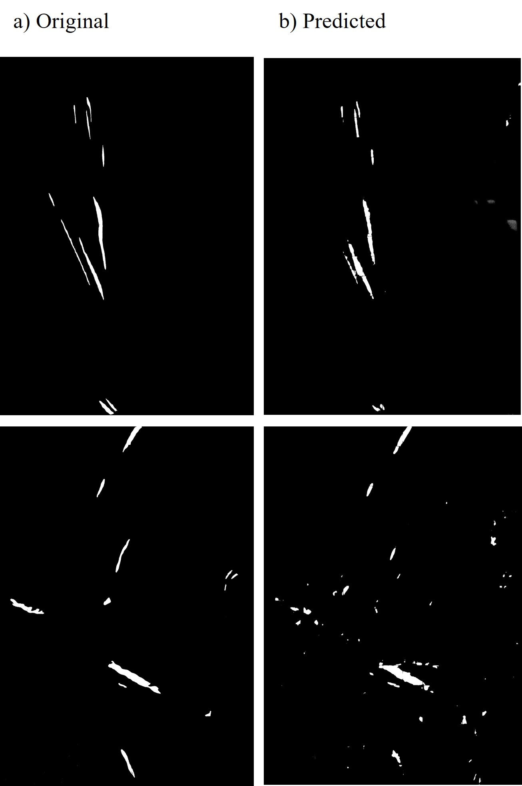

*Figure 6 (p. 11). (a) Original binary mask of diseased leaves; (b) the model's prediction.*

---

## 6. Claims and verification

Each claim is checked against the paper's own numbers. The recomputations are
F1 = 2PR/(P+R) and, for a pooled confusion matrix, IoU = F1/(2−F1).

| # | Claim (as stated) | Evidence in the paper | Check | Verdict |
|---|---|---|---|---|
| C1 | NWRD is the first multi-leaf, wide-angle wheat-rust *segmentation* dataset | Table 1; §1 | Only CDTS is also segmentation, and it is close-view, single-leaf | **Supported** (within the datasets surveyed) |
| C2 | APF "reduces the total number of patches by almost 10 times" (p. 8) | Table 2 | 72,592 / 12,000 = **6.0×** (22 img); 327,929 / 80,000 = **4.1×** (100 img) | **Overstated.** Table 2 shows 4–6× |
| C3 | APF substantially reduces training time with comparable accuracy | Table 3 | 22 img: 15,820 → 2,661 min (**5.9×**) for 0.684 → 0.650 F1. 100 img: APF-32 beats GP-128 on F1 and time | **Supported** |
| C4 | UNet + APF outperforms the state of the art (Octave-UNet) in F1 and IoU | Table 4 | +0.035 F1, +0.122 IoU, one run each, no variance or significance test; Octave-UNet retrained by the authors | **Supported as reported**, but thin: single runs |
| C5 | Downsampling causes only "a slight decrease in the F1 score" | §3.4.1 | No table or number is given | **Unsupported** by data in the paper |
| C6 | Reported metrics are internally consistent | Tables 3–4 | See below | **Partly.** Four of six Table 3 rows check out exactly; the other two rows and all of Table 4 don't |

**C6 in detail.** F1 recomputed from the reported P and R:

| Row | P | R | F1 reported | F1 = 2PR/(P+R) | Difference |
|---|---|---|---|---|---|
| T3 GP 22 / 128 | 0.694 | 0.557 | 0.618 | 0.6180 | 0.000 ✓ |
| T3 GP 22 / 32 | 0.683 | 0.685 | 0.684 | 0.6840 | 0.000 ✓ |
| T3 APF 22 / 128 | 0.685 | 0.555 | 0.613 | 0.6132 | +0.000 ✓ |
| T3 APF 22 / 32 | 0.578 | 0.743 | 0.650 | 0.6502 | +0.000 ✓ |
| T3 GP 100 / 128 | 0.510 | 0.544 | 0.514 | 0.5265 | **+0.013** |
| T3 APF 100 / 32 | 0.506 | 0.624 | 0.557 | 0.5588 | +0.002 |
| T4 Octave-UNet | 0.580 | 0.497 | 0.529 | 0.5353 | **+0.006** |
| T4 UNet | 0.593 | 0.552 | 0.564 | 0.5718 | **+0.008** |

And IoU against F1 in Table 4: a pooled F1 of 0.564 implies IoU **0.393** (reported 0.438); 0.529
implies **0.360** (reported 0.316). Reasoning: the 22-image rows match to the third decimal, so the
paper computes F1 from pooled P and R there. The mismatches suggest the full-dataset and Table 4
metrics were **averaged per image or per patch**, where F1 and IoU don't follow from mean P and R.
Nothing here suggests an error in the models. It means these numbers should be treated as
**approximate** and not compared to the decimal with pooled metrics like ours.

---

## 7. Limitations (the authors' and ours)

Stated by the authors:

> "One of the limitations of our work is the class imbalance problem prevalent in the NWRD dataset."
> (p. 13, §5)

> "Since the rust spots, as compared to the healthy part of the leaf in most of the images, are very
> small, the UNet model is not performing at its best." (p. 13, §5)

> "The initial results of the segmentation are promising, with room for further improvement."
> (p. 13, §5)

Additional observations relevant to our comparison:

1. **Single runs.** No seed variance or confidence intervals, so differences of a few hundredths
   (C4) can't be told apart from run-to-run noise.
2. **Small test set.** 10% of 100 images is **10 test images** (2,737 patches). Patches from one
   image are correlated, so the effective sample size is closer to 10 than to 2,737.
3. **No pretraining.** The UNet is trained from scratch on 80 images. The authors themselves name
   "fine-grained feature extraction" as future work (p. 14, §6), which is exactly where ImageNet
   encoders and context modules such as CANet's come in.
4. **Limited context.** A 128px patch of a 0.5×-downsampled image covers roughly 256×256 original
   pixels, which limits how much surrounding leaf structure the model can use.

---

## 8. What this means for our project

| From the paper | How we use it |
|---|---|
| NWRD dataset and its rust-class metrics | Same task and metrics (P, R, F1 = Dice, IoU) |
| UNet (4 enc / 4 dec) is the published model | Re-implemented (`unet`) and re-trained under our protocol for a like-for-like comparison, plus `unet_tuned` with a from-scratch lr so the baseline isn't handicapped |
| Table 4 removes background-only patches | We also report a matching "rust-positive patches only" metric |
| Their argument that background must stay in training and test | Adopted: 20% of background patches kept in training, all kept in test |
| APF patch sampling | **Not reproduced.** Our comparison tests the architecture, not APF (see `compare.md` §8) |
| Their full-image test protocol | Not reproducible from `nwrd-patched`, which lacks the source images and patch coordinates |

Our hypotheses about why CANet-B4 should do better on the weaknesses the authors name (small
spots, class imbalance, fine features), and the measured efficiency comparison (CANet-B4 needs
10.4× fewer FLOPs than this UNet at 512²), are in [`compare.md`](compare.md) §3.
